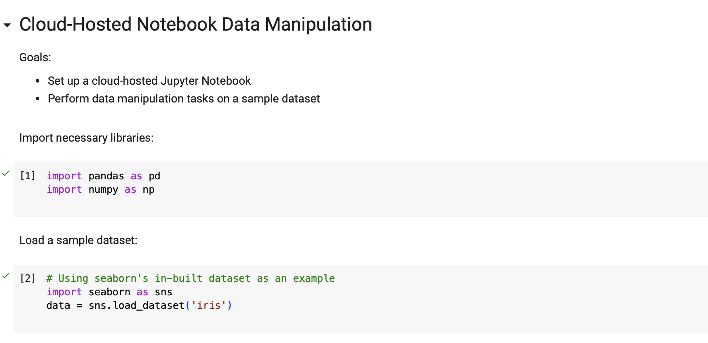

# Week9: Cloud-Hosted Notebook Data Manipulation
## Goals:
- Set up a cloud-hosted Jupyter Notebook (e.g., Google Colab)
- Perform data manipulation tasks on a sample dataset

## Source Code:
Colab link:https://colab.research.google.com/drive/1J6G5X7d2dgJ_L-rEkqobkk6X9j2xwP_O?usp=sharing

## Colab Demo:

